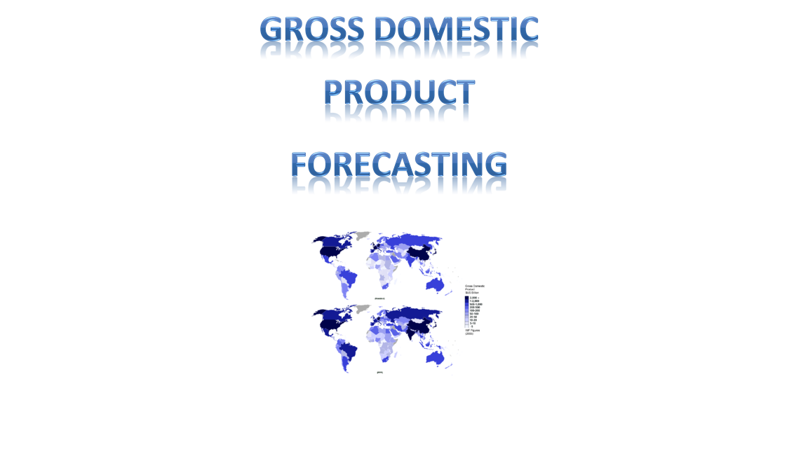

# GDP Project
### GDP Forcasting
This was my independent project during my undergrad at CSUS in Spring 2012. I analyze GPD data in excel and stat software.  I was using excel for data analysis. I did statistics and forecasting.  As for statistics, I used hypothesis testing, linear regression, R-squared, and Significance F. 

### Purpose of this research paper
The purpose for this project is to explain the variation of GDP independent variables and use ten independent variables that relates to GDP. 

### RELATIONSHIPS TO BE RESEARCHED

1.	GDP in billions of chained 2005 dollars 
2.	GDP percent change based on current dollars
3.	GDP percent change based on chained
4.	GDP (Chained) Price Index
5.	Receipts
6.	Outlays
7.	Gross Federal Debt
8.	Surplus or Deficit (-)
9.	Individual Income Taxes
10.	Corporate Income Taxes

### Author’s Name: Tin Hang  
### Course Name: DS 101 Data Analysis For Managers  
### Course Number: 31470  
### Instructor’s Name: Moti Malkani  
### Instructor’s Email: malkanim@csus.edu  
### California State University, Sacramento  

